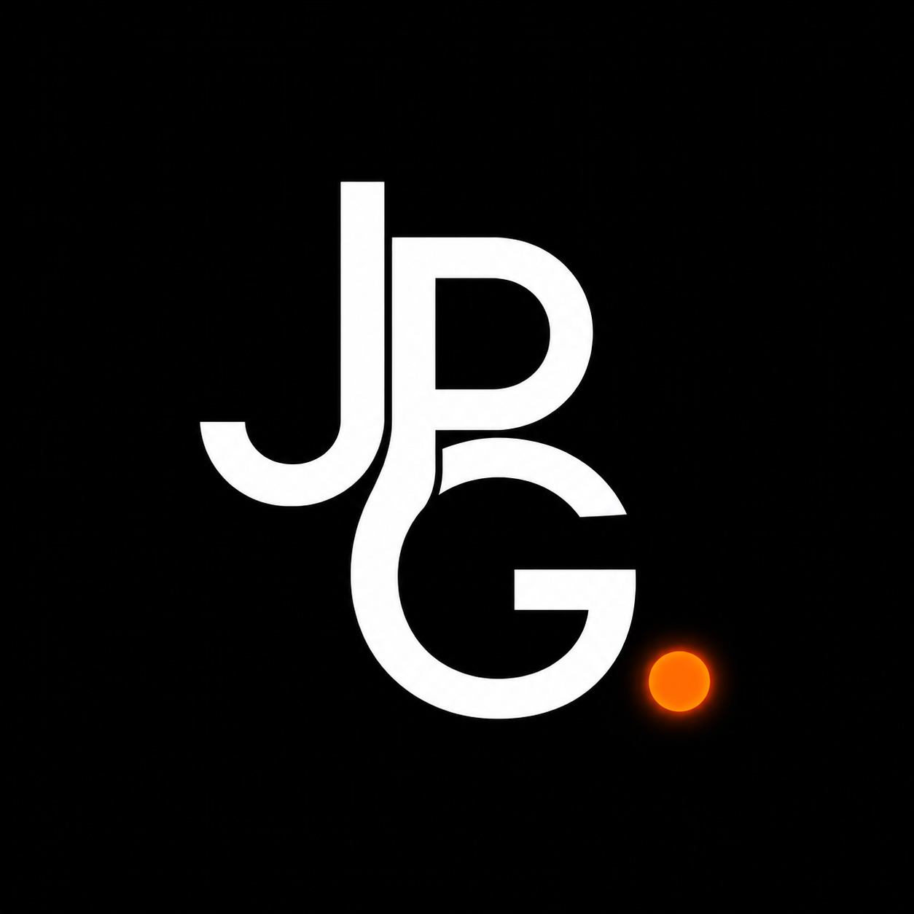
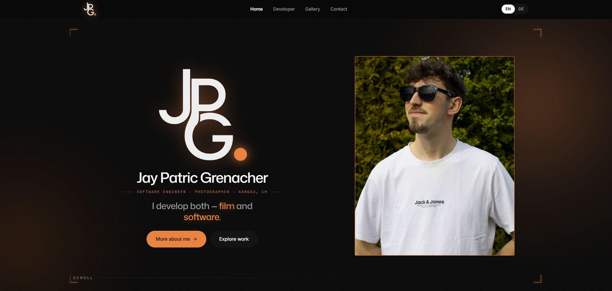

<div align="center">



# JPG Portfolio

**Personal developer and photography portfolio**

A fast, bilingual portfolio showcasing my software development projects, technical skills and photography work.

[Live Website](https://jaygrenacher.ch)

</div>

---

## About

This is my personal portfolio website, built to bring together my two main creative and technical interests: **software development and photography**.

The website includes a dedicated developer section for my software projects as well as a photography gallery showcasing selected work and camera information.

The goal was to create a portfolio that feels personal and visually distinctive while remaining fast, responsive and accessible.

---

## Preview



---

## Features

- Bilingual content in English and German
- Dedicated developer portfolio
- Photography gallery
- Responsive desktop and mobile layouts
- Custom animations and scroll interactions
- Reduced-motion support
- Semantic and keyboard-accessible interface
- Custom design system using hand-written CSS
- Static deployment without a backend

---

## Tech Stack

| Area | Technology |
| --- | --- |
| Frontend | React 19 |
| Build Tool | Vite |
| Languages | JavaScript, HTML, CSS |
| Styling | Custom CSS |
| Hosting | Vercel |
| Version Control | Git and GitHub |

The project intentionally uses **no UI framework**. The visual design, responsive layout and animations are implemented with custom CSS.

---

## Project Structure

```text
src/
├── components/
│   ├── home/
│   ├── developer/
│   ├── gallery/
│   └── layout/
├── data/
├── pages/
├── styles/
└── utils/

public/
└── images/
    ├── logos/
    ├── projects/
    ├── gallery/
    └── placeholders/

docs/
├── jpg-portfolio-logo.webp
└── portfolio-preview.webp
````

The project is separated into reusable components and dedicated data files for projects, skills, navigation and photography content.

---

## Design and Accessibility

The portfolio was designed from scratch with a strong focus on typography, spacing and visual hierarchy.

Accessibility considerations include:

* Semantic HTML structure
* Keyboard-accessible interactive elements
* Visible focus states
* Responsive layouts
* Support for `prefers-reduced-motion`

Animations and parallax effects are reduced when the user's operating system requests less motion.

---


## Deployment

The production website is deployed on **Vercel** and available at:

**https://jaygrenacher.ch**

The application is built as a static frontend and does not require a backend or database.

---

## Author

**Jay Grenacher**

Informatics Student and Application Developer from Switzerland.

[Portfolio](https://jaygrenacher.ch) · [GitHub](https://github.com/Jayyy-PG)

